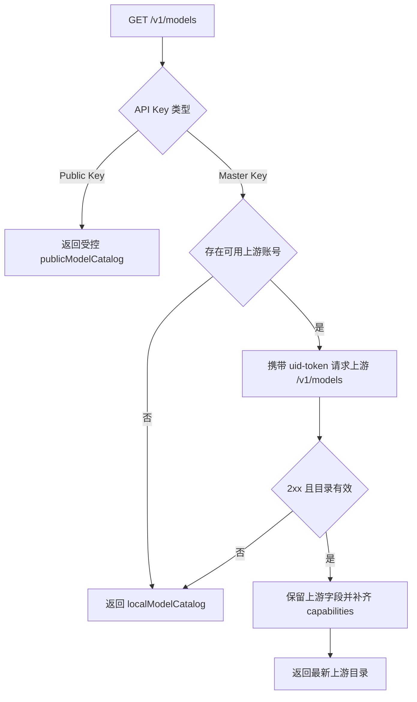

# NavOS 上游模型目录逆向与接入报告

## 结论

NavOS 上游提供需要账号鉴权的 `GET /v1/models`。项目曾直接代理该接口，后在提交 `249f87e` 中改为只返回本地常量，导致模型目录持续依赖人工更新。本次恢复管理员侧的上游发现能力，并保留无账号或上游异常时的本地回退。

公共代理 Key 仍返回受控白名单，避免本次目录更新意外扩大公开模型范围。

## 证据

| 证据 | 结果 |
|---|---|
| 未携带上游账号访问 `https://navos-mind-server-backend.tec-do.com/v1/models` | HTTP 401，错误码 `TOKEN_INVALID`，确认接口存在且要求账号鉴权 |
| Git 提交 `975b037` | 首次实现上游 `/v1/models` 代理，404 时回退本地目录 |
| Git 提交 `249f87e` | 删除上游请求，改为始终返回 `localModelCatalog()` |
| 当前认证实现 | `uid-token` 模式使用 `Authorization: Bearer <uid>:<token>` |

## 实现



改动点：

- `src/server/app.ts`
  - 管理员请求优先读取上游模型目录。
  - 对缺失 `capabilities` 的模型用现有 `modelCapabilities()` 补齐。
  - 无账号、非 2xx、空目录、格式错误或网络异常时返回本地目录。
- `src/protocols/model-proxy.ts`
  - 保留既有 canonical/alias 映射，并将除 `claude.*` 外的 `provider.model` 形式识别为上游原生 OpenAI 兼容模型，避免新渠道模型被误送到 Claude `/v1/messages`。
- `tests/server.test.ts`、`tests/model-proxy.test.ts`
  - 覆盖上游目录读取、鉴权头、能力补齐及未知新模型路由。

## 验证

```powershell
npx vitest run tests/server.test.ts tests/model-proxy.test.ts
npm run typecheck
npm run build
```

验证结果：目标测试 129/129 通过；排除既存问题文件 `tests/admin-app.test.tsx` 后，其余 36 个测试文件 433/433 通过；TypeScript 类型检查和生产构建通过。`admin-app` 中的长视频提示词测试仍固定在 20 秒超时，单独运行同样复现，且本次未修改该文件或对应视频编辑器路径。

## 运行时复现

项目账号池至少有一个有效账号后，用管理员 Key 请求：

```powershell
Invoke-RestMethod http://127.0.0.1:18888/v1/models -Headers @{
  Authorization = "Bearer <MASTER_API_KEY>"
}
```

响应中的模型顺序与 ID 来自当前上游目录；上游不可用时响应仍保持 OpenAI `object: "list"` 格式并使用内置回退列表。
